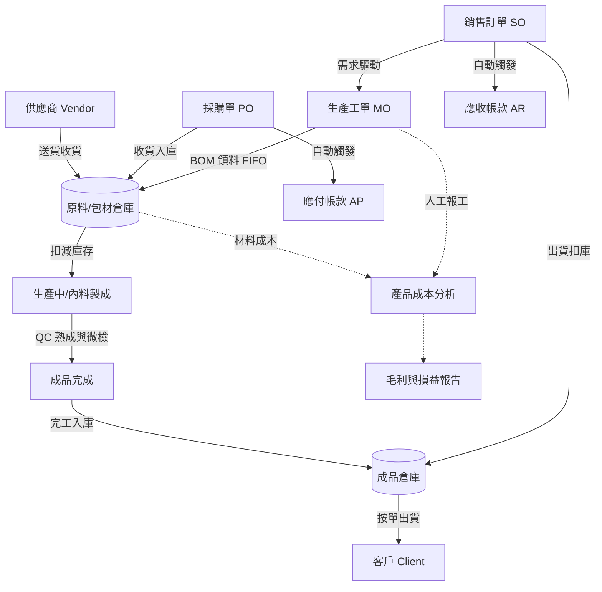

# 3DL ERP 系統 — 財務、人資與成本分析完工說明 (Phase 4)

我們已經完成了系統最核心的「大腦」部分。現在系統不僅能管生產與倉庫，還能精確地幫您算錢、管人、看損益。

## 💰 財務核算模組 (8_💰_財務核算.py)

### 1. 自動化帳務觸發 (Accounting Triggers)
*   **應收帳款 (AR)**：當您在「訂單管理」將訂單標記為 **「已出貨」** 時，系統會自動產生一筆應收帳單。
*   **應付帳款 (AP)**：當您在「採購管理」執行 **「收貨入庫」** 時，系統會根據採購單價自動產生應收帳款。

### 2. 稅務與發票
*   **5% 營業稅**：所有帳務預設按 5% 計算稅額。
*   **發票管理**：提供「發票號碼」填寫欄位，方便財務人員與實體發票對帳。

### 3. 銀行收付款核銷
*   您可以在「銀行帳戶管理」建立多個帳戶（如：台銀、公司金庫）。
*   當帳款入帳時，選擇對應銀行，系統會自動更新銀行餘額。

---

## 🧑‍💻 人力資源與成本分析

### 1. 直/間接人員管理 (9_🧑‍💻_人力資源.py)
*   建立員工資料時可選擇「直接人員 (產線)」或「間接人員 (行政)」。
*   設定每位員工的「時薪」，這是計算生產成本的關鍵。

### 2. 生管報工介面
*   生管人員可以在此介面將產線員工「配給」到具體的工單 (MO)。
*   系統會記錄：誰、在哪一天、針對哪張工單、做了什麼工作（如：攪拌）、做了多久。

### 3. 多維度生產成本分析 (重點)
在財務頁面的「成本分析」頁籤，您可以選擇任一工單看損益：
*   **原料成本**：根據 BOM 實際領料狀況與庫存成本單價計算。
*   **直接人工**：根據報工紀錄的時數 * 員工時薪計算。
*   **製造費用**：提供「分攤率」拉桿，模擬間接成本（如電費、折舊）的分攤。
*   **單位成本**：系統會自動算出「這一瓶產品實際做下來，每一支到底花了多少錢」。

---

## 🛠 系統完整閉環與物資流向圖

這套系統不僅管理單據與財務，更精確追蹤了**原物料的實體流向**：

## 接下來的建議
您可以先到「人力資源」建立幾位員工，並在「財務核算」建立一個銀行戶頭。接著嘗試模擬一次「採購收貨 -> 應付帳款 -> 銀行付錢」的完整過程。
目前這套 ERP 已具備完整規模，若您未來需要對接電子發票系統或是生產看板大螢幕，隨時告訴我！
