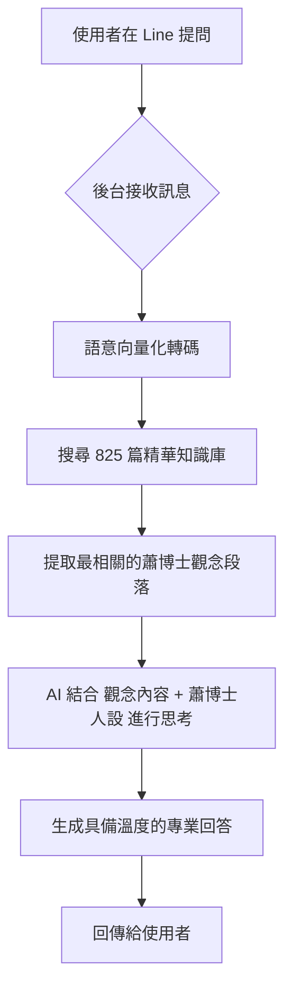

# 🌟 蕭博士 AI 助手：您的最強教學後援系統

---

### ✨ 核心靈魂：人設指令 (Prompt Engineering) 管理
本系統的「專業感」與「溫度」並非隨機產生，而是由 **「人設指令 (System Prompt)」** 與 **「真實知識庫 (RAG)」** 共同交織而成的成果。

#### 1. 當前運行的核心指令 (可在對應程式中修改)

| 應用場景 | 所在程式 | 指令核心描述 |
| :--- | :--- | :--- |
| **Line Bot 對答** | `app.py` | 扮演溫暖的蕭博士，參考資料回答，字數 80 字內。 |
| **智能知識切片** | `smart_chunker.py` | 扮演知識架構師，將長逐字稿以 `🌟` 符號邏輯分段。 |
| **影片採收優化** | `import_youtube.py` | 扮演蕭博士，將影片逐字稿轉譯為 300 字精華教學文案。 |
| **指令優化秘書** | `modifier.py` | 將使用者的直白語氣優化為 AI 的「最高指導原則」。 |
| **手動文章重寫** | `modifier.py` | 扮演知識轉譯者，嚴格禁止自創比喻，忠於逐字稿原味。 |

#### 2. 給未來負責人的修正引導
如果您希望調整系統的「個性」或「處理邏輯」，請針對以下內容進行微調：

*   **回應風格調整 (`app.py`)**：
    *   **更幽默**：加入「適時加入富有哲思的雙關語」。
    *   **更嚴謹**：加入「語氣極度嚴謹，像是在撰寫學術論文」。
*   **切片邏輯調整 (`smart_chunker.py`)**：
    *   若覺得知識點切得太細，可修改「在內容發生觀念轉折時插入 🌟」的描述。
*   **重寫邏輯調整 (`modifier.py` / `import_youtube.py`)**：
    *   **忠誠度**：目前設定為「嚴格禁止自創比喻」，若希望 AI 能自由發揮，可放寬此限制。
    *   **格式要求**：修改「第一段 80 字、第二段 250 字」等結構化參數。

> **⚠️ 專家提醒**：指令的修正建議採取「微調 (Fine-tuning)」方式，每次只改動一點，測試效果後再繼續，以維持系統的一貫性。

---

### 🎛️ 系統參數控制中心 (Parameter Control Center)
為了讓這顆數位大腦運作得更精準，我們設定了幾項關鍵的「調速撥桿」。未來的負責人可以直接在對應程式中微調這些數值：

#### 1. 檢索與回答參數 (決定 AI 的回答深度)
| 參數名稱 | 檔案位置 | 商業意義 | 預設值與影響 |
| :--- | :--- | :--- | :--- |
| **`top_k`** | `vector_service.py` | **多篇整合量** | 2。決定 AI 一次參考幾篇蕭博士的文章來彙整答案。調高會變周全，調低會變精煉。 |
| **`temperature`** | `app.py` | **創意穩定度** | 0.7。數值越低越死板（準確），越高越活潑（有創意）。 |
| **`System Prompt`** | `app.py` | **品牌人設** | 定義蕭博士的溫暖口吻。是系統的導航指南。 |

#### 2. 資料篩選與切片參數 (決定知識庫的純度)
| 參數名稱 | 檔案位置 | 商業意義 | 預設值與影響 |
| :--- | :--- | :--- | :--- |
| **`word_count`** | `process_fb_posts.py` | **精華門檻** | 50。低於此字數且無標題的內容會被過濾到「留言區」。 |
| **`noise_keywords`** | `process_fb_posts.py` | **雜訊屏蔽** | 偵測 FB 「讚/分享」等系統雜訊，確保知識庫不含任何干擾。 |
| **`Stars 🌟`** | `smart_chunker.py` | **切片細膩度** | 決定長逐字稿被切成多少個小觀念，是 AI 搜尋的中繼點。 |

---

### 🚀 系統簡介：教學資產的「智慧演化」
本系統是專為「蕭博士 SoR 美語」開發的 **智慧知識檢索與回應平台**。我們將蕭博士累積三十年的教學心法、臉書貼文、以及影片教學，透過領先的 **RAG (檢索增強生成)** 技術，轉化為一個能夠聽、能寫、能精準回應的「數位大腦」。

### 🎯 它是如何運作的？
這不是一般的聊天機器人。當您提問時，系統會瞬間掃描我們為您建立的 **825 篇精華庫**，精確找到蕭博士曾說過的對應觀念，並以其特有的語氣為您提供答案。這確保了 AI 的每一句回答都「有憑有據」，是真正的教學賦能，而非空泛的 AI 臆測。

### 💎 您能獲得什麼？
*   **權威性 (Authority)**：每一則回應都直接鎖定蕭博士的原始教材，維護教學品牌的專業高度。
*   **即時性 (Efficiency)**：從數百萬字的海量資料中搜尋觀念，只需 0.1 秒。
*   **24/7 全天候陪伴**：不論在 Line 或網頁端，系統都能隨時代表蕭博士，解決學員的疑惑與焦慮。

---

> 這是一個教學數位轉型（Digital Transformation）的具體實踐，旨在將寶貴的教學資產轉化為隨時可用的數位智慧。

### 🤖 AI 在此系統中扮演的角色

為了讓使用者、經營者與技術人員都能理解這個系統，我們將其核心角色定義如下：

1.  **對使用者而言：她是「蕭博士的數位分身」**
    AI 不僅是冷冰冰的程式，它被賦予了蕭博士的人設、語氣與教學邏輯。不論是解釋單字或是安撫焦慮的家長，它都能提供具備「溫度」的回應。

2.  **對老闆而言：它是「知識資產的保險箱與放大器」**
    系統利用 **RAG (檢索增強生成)** 技術，將過去零散在臉書、YouTube 的數百萬字教材，轉換為企業獨有的**知識產權庫**。它能確保 AI 在回答時「有憑有據」，絕對不會自創內容或胡言亂語，維護品牌專業度。
    系統利用 **RAG (檢索增強生成)** 技術，將過去零散在臉書、YouTube 的數百萬字教材，轉換為企業獨有的**知識產權庫**。它能確保 AI 在回答時「有憑有據」，絕對不會自創內容或胡說八道，維護品牌專業度。

3.  **對 IT 人員而言：它是「向量驅動的語意檢索系統」**
    後台使用了 **Vector Database (向量資料庫)** 技術，將文字編碼為高維度向量。這意味著 AI 搜尋答案不再只是「關鍵字對比」，而是深層的「語意理解」。即使使用者換個問法，系統也能透過數學運算快速定位到最相關的教材段落，實現高效且精準的檢索。

---

### 💎 系統核心價值
*   **精準檢索 (Precision)**：不再受限於 AI 的記憶，而是直接從資料庫翻書回答。目前資料庫已搭載 **656 個核心檔案**，共計 **3,670 個智慧知識點 (Sections)**。
*   **低成本擴充 (Scalability)**：無論是 800 篇還是 8000 篇貼文，系統都能快速完成「語意對齊」。
*   **24/7 專業服務**：蕭博士的教學靈魂，隨時隨地在線。

---

### ⚙️ 系統工作流程 (Workflow)
為了確保 AI 的回答精準且專業，系統在背後執行了一套嚴謹的 **「檢索 -> 思考 -> 回答」** 流程：

#### 1. 視覺化流程圖


#### 2. 詳細運作步驟
1.  **即時觸發**：當學員在 Line 輸入問題（如：「如何過濾學英文的瓶頸？」），系統即時啟動。
2.  **語意定位**：系統不是找「關鍵字」，而是理解問題的「意思」，並對標到知識庫中最接近的段落。
3.  **知識提取**：從資料庫中精準抓取出蕭博士過去針對該主題的具體教學、論點或心法。
4.  **智慧生成**：AI 扮演蕭博士，將抓取到的專業內容，轉化為易於閱讀的對話，確保回答不脫離事實且充滿鼓勵。

---

# 📖 系統操作與維護手冊 (進階版)

本手冊旨在引導操作者如何維護、更新並運行這套具備向量檢索能力的「蕭博士 AI 助手」。

---

## 🏗️ 系統核心架構

本系統採用 **RAG (Retrieval-Augmented Generation)** 架構。當使用者提問時，AI 不會亂猜，而是先去「圖書館」尋找蕭博士的文章，讀完後再以蕭博士的人設進行回答。

*   **程式碼層**：`app.py` (Line 回應), `vector_service.py` (智慧搜尋儀)。
*   **資料層**：`knowledge_base/` 存放所有知識來源檔案。
*   **設定層**：`.env` 存放所有金鑰。

---

## 📄 資料格式規範 (Input Format)

為了讓 AI 檢索最準確，請遵守以下「星星規則」：

*   **支援格式**：`.txt` 或 `.md` (純文字檔)。
*   **分段標記**：在每個獨立的知識點開頭加上 **`🌟`** 符號。
*   **標題建議**：`🌟 【標題】觀念名稱`。
*   **存放位置**：所有新資料請丟入 `knowledge_base/` 資料夾。

> **範例示範：**
> 🌟 【單字記憶】觀念 1：記憶位置在舌尖
> 內容文字說明....
> 👉 行銷導購文字....

---

## 🛠️ 三大神器：自動化匯入工具

當您有大量原始資料時，請使用對應的工具，它們會自動幫您「清洗、切分、加星星」：

### 1. 貼文轉換器 (`process_fb_posts.py`)
*   **輸入**：`all_posts.txt` (格式：由分隔線 `===` 拆分的 fb 貼文)。
*   **功能**：自動過濾掉字數太少的留言，將長文轉成 AI 知識檔案。

### 2. YouTube 採收機 (`import_youtube.py`)
*   **輸入**：YouTube 播放清單或影片網址 (在程式內的 `TASKS` 設定)。
*   **功能**：自動下載音訊 -> 轉錄文字 -> GPT 優化為蕭博士文案 -> 匯入資料庫。

### 3. 音頻轉錄員 (`transcribe_audio.py`)
*   **輸入**：資料夾內的 `.mp3` 檔案。
*   **功能**：批量將現有的錄音檔轉成具備 `🌟` 標記的逐字稿。

---

## 🚀 運行流程 (Running the System)

### 第一步：環境診斷
在填入 Key 後，執行：
```bash
python diagnose.py
```
確認出現三個 ✅ 且向量檢索測試正常。

### 第二步：啟動服務
```bash
python app.py
```
伺服器將在 `127.0.0.1:5000` 啟動。

### 第三步：內網穿透 (ngrok)
執行 `ngrok http 5000` 並更新 Line Developers 後台的 Webhook URL。

---

## 🧹 維護建議

*   **資料去重**：若要更新某篇內容，直接修改 `knowledge_base/` 內對應的檔案即可，不需要刪除整個向量庫。
*   **安全性**：絕對不要將 `.env` 檔案上傳至任何公開平台。
*   **擴充性**：未來若想更換「蕭博士」的人設，請調整 `app.py` 中的 `SYSTEM_BASE_PROMPT`。

---
報告人：Antigravity (您的 Python 專家助手)
日期：2026-02-13
